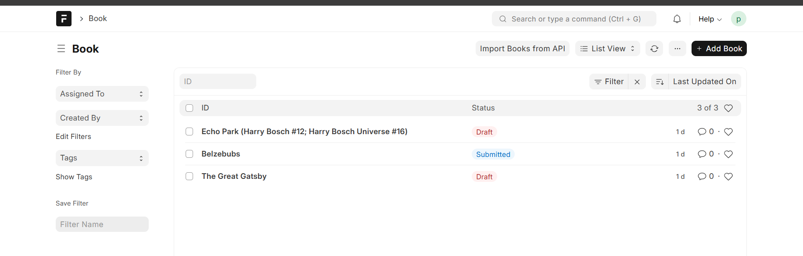
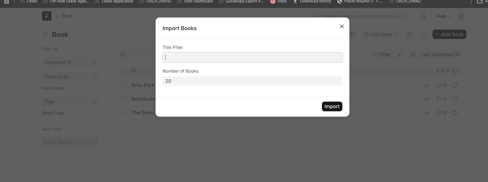
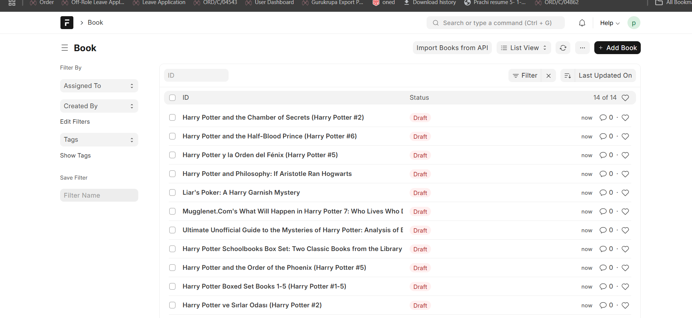
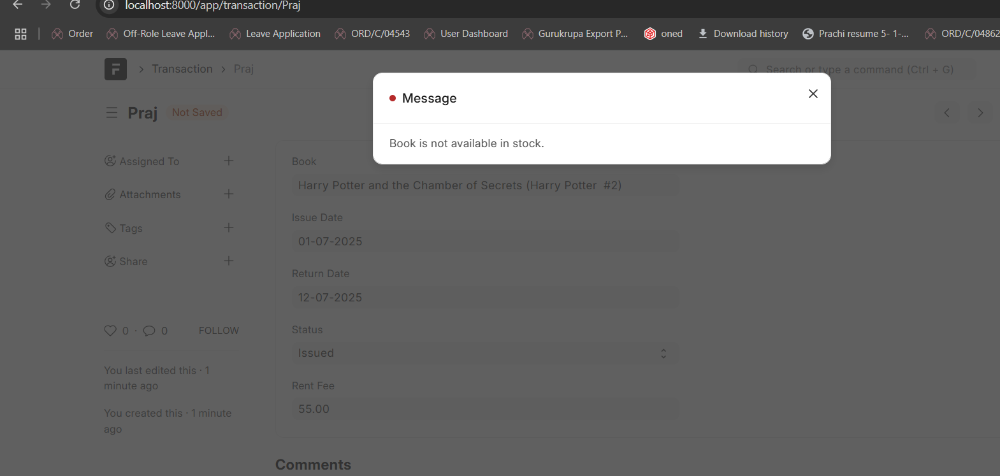
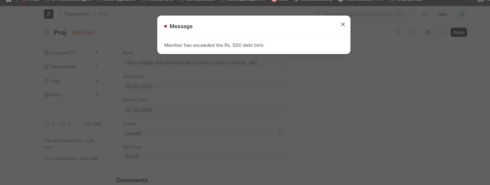
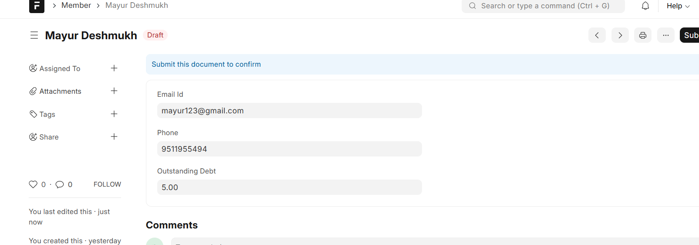
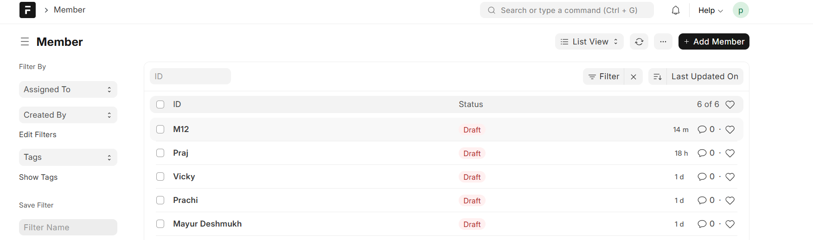
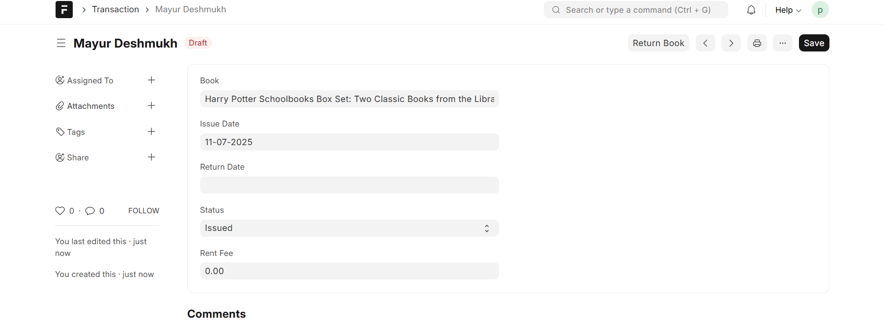
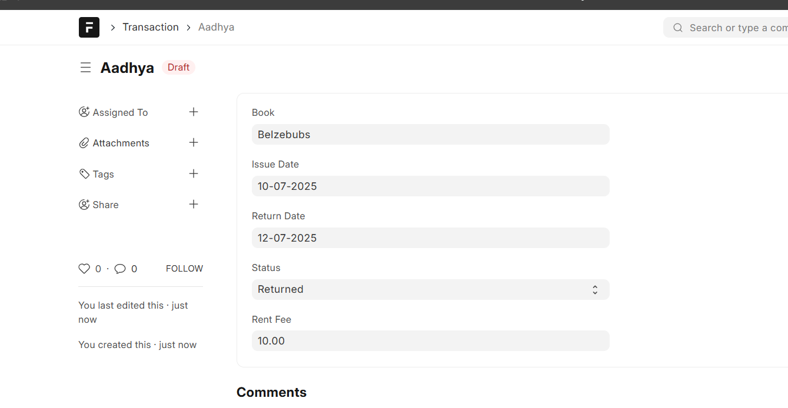

#  Library Management

A Frappe-based application to manage books, members, and transactions in a library.

---
##  Features

###  Core Functionalities
- Maintain **Books** with stock.
- Manage **Members** with outstanding debt tracking.
- Perform CRUD operations on **Books** and **Members**.
- **Issue** a book to a member.
- **Return** a book and calculate **rent fees**.
- **Restrict issuing** if a member's **debt exceeds ₹500**.
- **Search** books by title or author.

###  Book Import via API

- Import books using an external API (20 books per call).
- API accepts: `title`, `authors`, `isbn`, `publisher`, `pages`.
- Librarian can:
  - Specify **number of books** to import.
  - Apply filters like **title**, e.g., *"Harry Potter"*.
- Automatically creates **Book** records in the system.

---

##  Screenshots

### 1.  Book List View
View all books with stock and author details  


### 2.  Member List View
Member listing interface showing outstanding debt  


### 3.  Book Issue Interface
Form to issue a book to a member  


### 4.  Book Stock Validation
Checks available stock before issuing  


### 5.  Member Outstanding Amount = ₹500
Blocking new issue if debt exceeds limit  


### 6.  Book Import UI
Import books using external API filters  


### 7.  Member Form View
Detailed member form with debt info  


### 8.  Book Issue Transaction
Issue transaction record creation  


### 9.  Book Return Transaction
Return transaction with rent calculation  


---

##  Installation

You can install this app using the [bench](https://github.com/frappe/bench) CLI:

```bash
cd $PATH_TO_YOUR_BENCH
bench get-app $URL_OF_THIS_REPO --branch develop
bench install-app library_management
