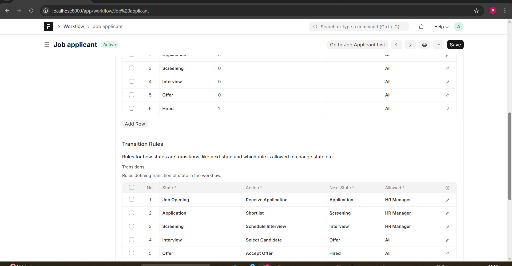
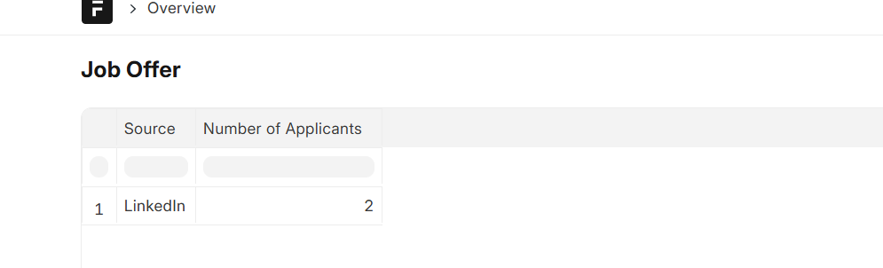
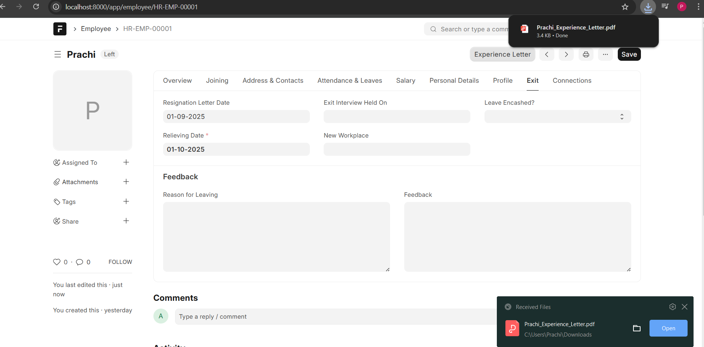
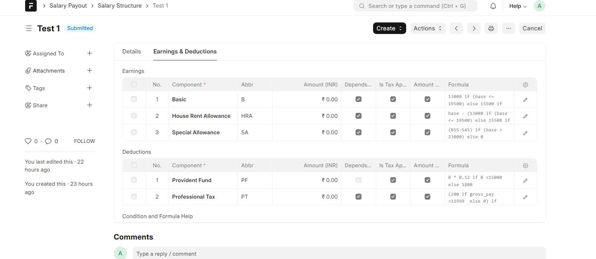
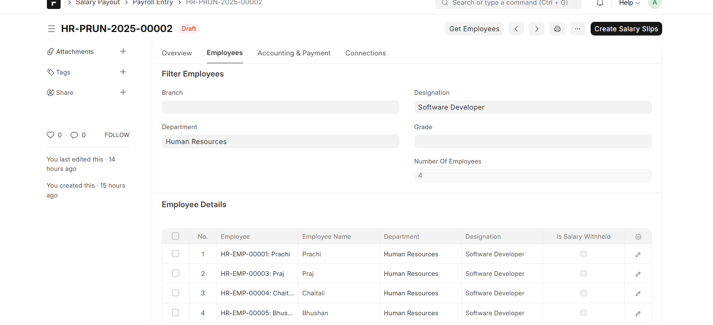
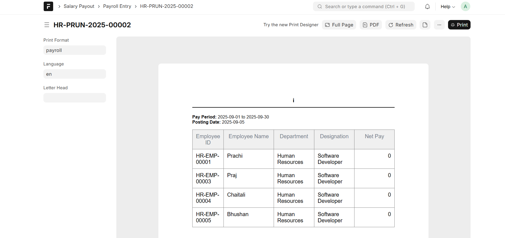
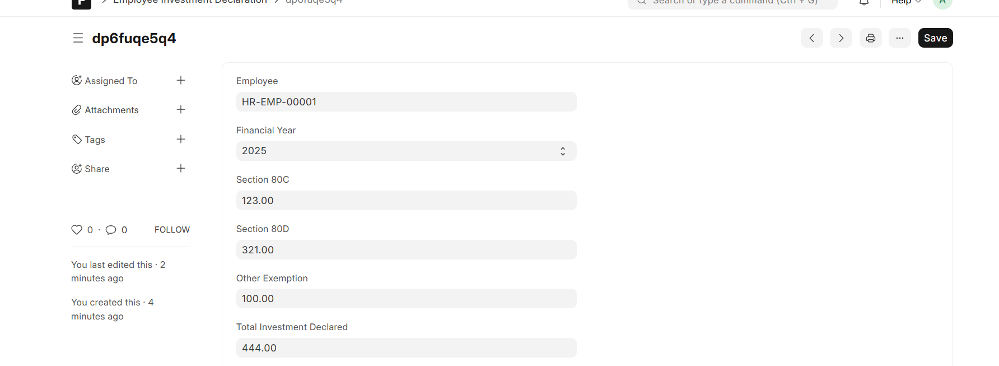

#  Library Management

A Frappe-based application to manage books, members, and transactions in a library.

---

##  Features

###  Core Functionalities

## Recruitment Workflow

-Manage Job Openings for different positions.
-Track Job Applications linked to openings.
-Move candidates across workflow stages:
-**Job Opening → Application → Screening → Interview → Offer → Hired**
-Assign **role-based** permissions:
**-HR Manager – Manage openings, applications, and offers**.
-Interviewer – Provide feedback during screening & interviews.
-Hiring Manager – Approve selections and move candidates to Offer/Hired.
-Add and track Source of Application (LinkedIn, Referral, Job Portal, Walk-in, Other).

## Recruitment Reporting & Dashboard

-Applicants per **Source – Visualize** number of candidates by application source.
-Applicants per **Stage – See how many candidates are in each workflow stage**.
-Conversion **Funnel – Track the movement of candidates from Job Opening → Hired**.
-Hiring **Insights – Measure effectiveness of different recruitment channels**.

## Employee Lifecycle

1.Configure the Employee Doctype to handle lifecycle events:

-**Joining → Probation → Confirmation → Exit**

2.Implement Automation:

-**On Confirmation, system should auto-update Employee Status**.
-**On Exit, system should generate an Experience Letter (PDF) automatically**.

## Salary Structure & Payroll

Create a Salary Structure with:

-Basic, HRA, Special Allowance, PF, Professional Tax
-Add both Earnings and Deductions
-Implement Payroll Entry for multiple employees.

**Generate a Custom Payroll Slip Print Format with company branding (logo, header, footer)**.

## Tax Regime Implementation

Implement support for Old and New Tax Regimes:

-Create two Salary Structures (Old Regime & New Regime).
-Add a custom field in Employee Doctype: Tax Regime Preference.

**On Payroll Run, system should pick the correct Salary Structure based on the employee’s chosen regime.**

## Employee Investment Declarations

Add a Custom Doctype: Employee Investment Declaration with fields:

-Section 80C (LIC, PPF, ELSS, etc.)
-Section 80D (Medical Insurance)
-Other Exemptions

**Link to Payroll so that declared investments are considered during tax calculations.**


##  Screenshots

### 1.  Recruitment Workflow
Workflow of Job Applicant


### 2.  Report Recruitment
showing the number of applicants per source.  


### 3.  Experience Letter
On click of this Button Experience Letter need to be download pdf of Experience Letter of the employee


### 4.  Salary Structure
Salary Structure with earnigs and dedustion  


### 5.  Payroll With multiple Employees
Payroll entry With multiple Employees 


### 7.  Payroll Entry Print Format
Payroll entry print format


### 7.  Employee Investment Declaration
Employee Investment Declaration  



Ensure structured, transparent recruitment with stage-based progression.
- Maintain **Books** with stock.
- Manage **Members** with outstanding debt tracking.
- Perform CRUD operations on **Books** and **Members**.
- **Issue** a book to a member.
- **Return** a book and calculate **rent fees**.
- **Restrict issuing** if a member's **debt exceeds ₹500**.
- **Search** books by title or author.

###  Book Import via API

- Import books using an external API (20 books per call).
- API accepts: `title`, `authors`, `isbn`, `publisher`, `pages`.
- Librarian can:
  - Specify **number of books** to import.
  - Apply filters like **title**, e.g., *"Harry Potter"*.
- Automatically creates **Book** records in the system.

---

##  Screenshots

### 1.  Book List View
View all books with stock and author details  


### 2.  Member List View
Member listing interface showing outstanding debt  


### 3.  Book Issue Interface
Form to issue a book to a member  


### 4.  Book Stock Validation
Checks available stock before issuing  


### 5.  Member Outstanding Amount = ₹500
Blocking new issue if debt exceeds limit  


### 6.  Book Import UI
Import books using external API filters  


### 7.  Member Form View
Detailed member form with debt info  


### 8.  Book Issue Transaction
Issue transaction record creation  


### 9.  Book Return Transaction
Return transaction with rent calculation  


---

##  Installation

You can install this app using the [bench](https://github.com/frappe/bench) CLI:

```bash
cd $PATH_TO_YOUR_BENCH
bench get-app $URL_OF_THIS_REPO --branch develop
bench install-app library_management
